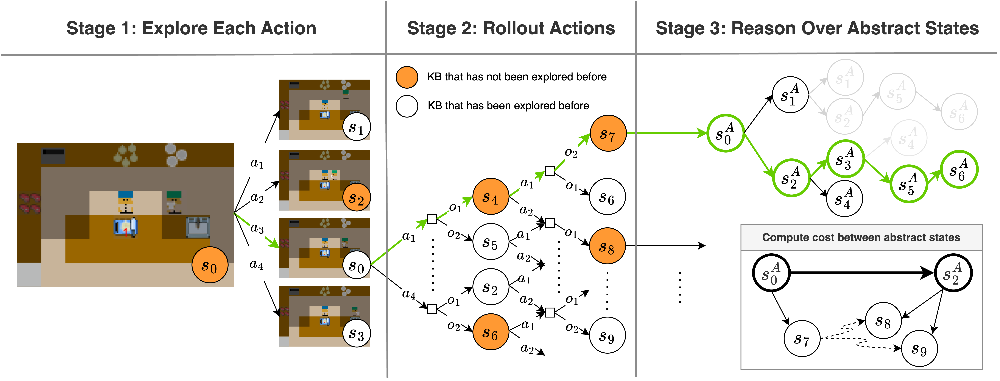

# Integrating Human Field of View in Human-Aware Collaborative #



## Project Overview ##

### Problem ###
Most research on human-AI collaboration assumes humans have full knowledge of their surroundings, 
which is unrealistic.

### Goal ###
Adapt to humans' changing subtask intentions while considering their limited FOV.

### Approach ###
- Integrate FOV into a human-aware probabilistic planning framework.
- Develop a hierarchical online planner to handle large state spaces efficiently.
- Enable the AI agent to explore actions that enter the human's FOV to influence their intended subtask.

### Validation ###
- Conducted a user study using a 2D cooking domain.
- Extended findings to a VR kitchen environment.

### Results ###
- The FOV-aware planner reduced interruptions and redundant actions during collaboration.
- Similar collaborative behaviors were observed in both 2D and VR environments.

### Significance ###
This research addresses a gap in human-AI collaboration by accounting for humans' perceptual 
limitations, potentially leading to more natural and efficient teamwork between humans and AI
agents.

## Installation Instructions ## 

### Versions ###
This project has mainly two versions:
- `v1.0` is the version used for experimentation.
- `v2.1` is the latest version which is identical to `v1.0` accept the code has been refactored in some places.
For all the tags available please check the releases page associated with this project [here](https://github.com/SophieHsu/3d-plan-eval/tags).

### Clone the Project ###
Cloning the version of the code you want to run.
```
git clone git@github.com:SophieHsu/3d-plan-eval.git -b <version>
```

### Install Oculus ###
TODO: add instructions

### Install Steam VR ###
TODO: add instructions

## Usage ##
- Setup
  - Start by setting up the  config and maps to be the same for both igibson and overcooked. If you're using the
    provided config files. This has already been done for you. 
- Starting the overcooked server
  - Begin by running the Overcooked server. You can use the following script
      ```
      python overcooked_ai_py/steak_api_test.py -l steak_side_2 -v 1
      ```
    where, `-v`: Defines the vision limitation of the AI agent. <br>
      1 = Aware (vision limited to the agent's field of view) <br>
      0 = Unaware (omniscient agent) <br>
    and `-l`: Defines the layout file (exclude the .tml extension).
  - Note: If planner files need to be recalculated, make sure to delete old planner files.
  - Alternatively, you can run the server with a restart mechanism (up to 5 restarts in case of crashes):
      ```
      ./steak_api_restart.sh
      ```
- Running the iGibson Simulator
  - Once the Overcooked server is running, start the iGibson simulation:
    ```
    python 3d_plan_eval_main.py -m vr -c steak_none_3.tml
    ```
  - `-m vr`: Runs the program in VR mode. If left out, the program will simulate a greedy human model operating in 
    the world. Other options are: [`headless`, `headless_tensor`, `gui_non_interactive`, `gui_interactive`, `vr`].
  - `-c steak_none_3.tml`: Defines the configuration file, which must match the config used in Overcooked.
- Playing the Level
  - While playing the level, the system will generate a JSON log file, which is saved in the `lsi_3d/logs` directory. 
    The log file will have a unique ID associated with the run.
- Running the Practice Room
  - Start Overcooked:
    ```
    python overcooked_ai_py/steak_api_test.py -l steak_practice -v 1
    ```
  - Start iGibson in VR mode:
    ```
    python 3d_plan_eval_main.py -m vr -c steak_practice.tml -p 1
    ```

## Project Structure ##
The most relevant components in the project are described below.
```
├── 3d_plan_eval_main.py
├── igibson/
├── lsi_3d/
│   ├── agents/
│   ├── config/
│   ├── environment/
│   ├── logs/
│   ├── mdp
│   ├── motion_controllers/
│   ├── planners/
│   ├── utils/
│   └── overcooked_state_dump.json
├── README.md
└── utils.py
```

### Main Scripts ###
- `3d_plan_eval_main.py` is the main entrypoint of the project that defines the necessary `RUNNER` class to 
    run the project.
### `iGibson` ###
- The `iGibson` directory contains the core components for the iGibson simulation framework. Please refer 
    [here](https://github.com/StanfordVL/iGibson) for more details.

### `lsi_3d` Components ###
- `agents` - This directory contains various files to define the agent classes that are responsible for low and high 
    level control of both the AI agents and the human player.
- `config` - This directory contains the files to set up configurations of the various components of this 
  project, namely, agent, algorithm, experiment and map. These configs are defined in
  [`toml`](https://toml.io/en/) files. 
- `environment` - This directory consists of files defining the elements of the environment. `vision_limit_env`, 
  `tracking_env` and `lsi_env` files contain implementations of different kinds of environments. The `kitchen` file
  defines the main class used to tie all components (VR environment, iGibson, planners, etc.) together. Other files, 
  `objects`, `object_configs` and `actions` define the objects, their configs within the environments and the actions
  that can be applied on them in the environment respectively.
- `logs` - Directory to store logs from experimental runs of the project.
- `mdp` - Implementation of out mdp solver.
- `planners` - Different planner implementations for different environment typer for different agents (human vs AI).
- `utils` - Common utility functions.

## Results ##

## Citation ##
Please cite this work using the following Bibtex:
```
Coming soon
```

## Contact ##
For any questions, reach out to: [yachuanh@usc.edu](mailto:yachuanh@usc.edu)