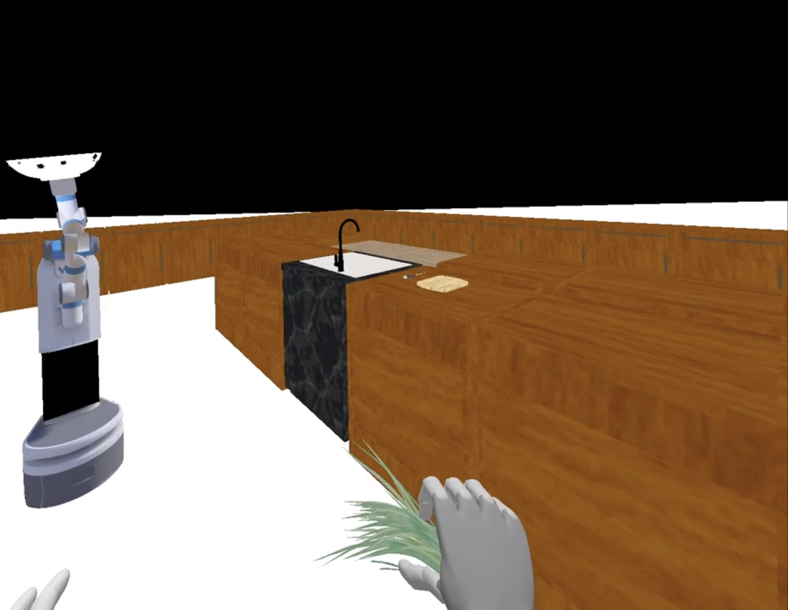

<!-- TOC -->
* [Integrating Human Field of View in Human-Aware Collaborative](#integrating-human-field-of-view-in-human-aware-collaborative)
  * [Project Overview](#project-overview)
  * [Installation Instructions](#installation-instructions)
    * [Versions](#versions)
    * [Clone the Project](#clone-the-project)
    * [Install SteamVR](#install-steamvr)
    * [Install Oculus](#install-oculus)
  * [Usage](#usage)
  * [Project Structure](#project-structure)
    * [Main Scripts](#main-scripts)
    * [`iGibson`](#igibson)
    * [`lsi_3d` Components](#lsi_3d-components)
  * [Results](#results)
  * [Citation](#citation)
  * [Contact](#contact)
<!-- TOC -->

# Integrating Human Field of View in Human-Aware Collaborative #
#### FOV Unaware Planner ####
<p align="center">
  
  
</p>

#### FOV Aware Planner ####
<p align="center">
  
  
</p>

#### Note: Due to difference in the sizes of the GIFs, they may start at different times and be unaligned. 

## Project Overview ##
Most research on human-AI collaboration assumes that humans have full knowledge of their surroundings, 
which is unrealistic given their limited field of view (FOV). This project aims to adapt AI systems to humans' 
changing intentions while accounting for these perception limitations. To achieve this, we integrate FOV into 
a human-aware probabilistic planning framework and develop a hierarchical online planner that efficiently 
navigates large state spaces. The AI agent is designed to explore actions that enter the human's FOV, 
influencing their intended subtask. We validated our approach through a user study conducted in a 2D cooking 
domain and extended our findings to a VR kitchen environment. Results showed that the FOV-aware planner reduced 
interruptions and redundant actions during collaboration, with similar collaborative behaviors observed in both 
2D and VR environments. This research addresses a critical gap in human-AI collaboration by accounting for human 
perceptual limitations, contributing to more natural and efficient teamwork between humans and AI agents.




## Installation Instructions ## 

### Versions ###
This project has mainly two versions:
- `v1.0` is the version used for experimentation.
- `v2.2` is the latest version which is identical to `v1.0` accept the code has been refactored in some places and 
  includes this readme with the instructions.
For all the tags available please check the releases page associated with this project [here](https://github.com/SophieHsu/3d-plan-eval/tags).

### Clone the Project ###
Cloning the version of the code you want to run.
```
git clone git@github.com:SophieHsu/3d-plan-eval.git -b <version>
```

### Install SteamVR ###
Install the SteamVR (found [here](https://store.steampowered.com/app/250820/SteamVR/)) using the steam platform.


### Install Oculus ###
- Perform the initial setup of your VR headset. For oculus/quest see [this](https://www.meta.com/blog/quest/you-got-a-quest-2-heres-how-to-set-it-up/).
- Set the VR headset to run with SteamVR. For oculus/quest see [this](https://docs.varwin.com/latest/en/instructions-for-using-the-oculus-quest-2-headset-2260861409.html).
## Usage ##
- Setup
  - Start by setting up the  config and maps to be the same for both igibson and overcooked. If you're using the
    provided config files. This has already been done for you. 
- Starting the overcooked server
  - Begin by running the Overcooked server. You can use the following script
      ```
      python overcooked_ai_py/steak_api_test.py -l steak_side_2 -v 1
      ```
    where, `-v`: Defines the vision limitation of the AI agent. <br>
      1 = Aware (vision limited to the agent's field of view) <br>
      0 = Unaware (omniscient agent) <br>
    and `-l`: Defines the layout file (exclude the .tml extension).
  - Note: If planner files need to be recalculated, make sure to delete old planner files.
  - Alternatively, you can run the server with a restart mechanism (up to 5 restarts in case of crashes):
      ```
      ./steak_api_restart.sh
      ```
- Running the iGibson Simulator
  - Once the Overcooked server is running, start the iGibson simulation:
    ```
    python 3d_plan_eval_main.py -m vr -c steak_none_3.tml
    ```
  - `-m vr`: Runs the program in VR mode. If left out, the program will simulate a greedy human model operating in 
    the world. Other options are: [`headless`, `headless_tensor`, `gui_non_interactive`, `gui_interactive`, `vr`].
  - `-c steak_none_3.tml`: Defines the configuration file, which must match the config used in Overcooked.
- Playing the Level
  - While playing the level, the system will generate a JSON log file, which is saved in the `lsi_3d/logs` directory. 
    The log file will have a unique ID associated with the run.
- Running the Practice Room
  - Start Overcooked:
    ```
    python overcooked_ai_py/steak_api_test.py -l steak_practice -v 1
    ```
  - Start iGibson in VR mode:
    ```
    python 3d_plan_eval_main.py -m vr -c steak_practice.tml -p 1
    ```

## Project Structure ##
The most relevant components in the project are described below.
```
├── 3d_plan_eval_main.py
├── igibson/
├── lsi_3d/
│   ├── agents/
│   ├── config/
│   ├── environment/
│   ├── logs/
│   ├── mdp
│   ├── motion_controllers/
│   ├── planners/
│   ├── utils/
│   └── overcooked_state_dump.json
├── README.md
└── utils.py
```

### Main Scripts ###
- `3d_plan_eval_main.py` is the main entrypoint of the project that defines the necessary `RUNNER` class to 
    run the project.
### `iGibson` ###
- The `iGibson` directory contains the core components for the iGibson simulation framework. Please refer 
    [here](https://github.com/StanfordVL/iGibson) for more details.

### `lsi_3d` Components ###
- `agents` - This directory contains various files to define the agent classes that are responsible for low and high 
    level control of both the AI agents and the human player.
- `config` - This directory contains the files to set up configurations of the various components of this 
  project, namely, agent, algorithm, experiment and map. These configs are defined in
  [`toml`](https://toml.io/en/) files. 
- `environment` - This directory consists of files defining the elements of the environment. `vision_limit_env`, 
  `tracking_env` and `lsi_env` files contain implementations of different kinds of environments. The `kitchen` file
  defines the main class used to tie all components (VR environment, iGibson, planners, etc.) together. Other files, 
  `objects`, `object_configs` and `actions` define the objects, their configs within the environments and the actions
  that can be applied on them in the environment respectively.
- `logs` - Directory to store logs from experimental runs of the project.
- `mdp` - Implementation of out mdp solver.
- `planners` - Different planner implementations for different environment typer for different agents (human vs AI).
- `utils` - Common utility functions.

## Task Instructions ##


## Results ##
Our study shows that FOV-aware agents reduce Knowledge Base (KB) gaps and interruptions in environments with limited 
human visibility, like the ∩-shaped kitchen. In open environments, such as the kitchen island, the difference is 
negligible. We validated these findings in a VR kitchen, where FOV-aware agents adapted to human behavior by staying 
within the human's field of view, enhancing collaboration.

#### Behavior 1: Robot prolongs its visibility to the human ####

Fig 1.1: The human starts by picking up a green onion. In the top row, the unaware robot goes to the sink to wash dishes. In the bottom row, the aware robot moves closer to the human, allowing them to see the robot and its actions for at least three consecutive timesteps when the human turns to drop off the green onion.


Fig 1.2: The unaware robot (top row) picks up the cooked meat and moves to the chopping board. The aware robot (bottom row) stopped halfway to the chopping board and continued until the human turned over and had the robot in FOV for three steps.

#### Behavior 2: Robot chose to take a longer path to enter the human's FOV ####

Fig 2: In the top row (unaware robot), the robot collects garnish from the chopping board and takes the shorter path on the left to deliver the dish. In the bottom row (aware robot), the robot waits for the human to notice it is picking up the garnish and, afterward, takes the longer route to deliver the dish, which enables it to remain within the human's FOV.

## Citation ##
Please cite this work using the following Bibtex:
```
Coming soon
```

## Contact ##
For any questions, please reach out to: [yachuanh@usc.edu](mailto:yachuanh@usc.edu)
