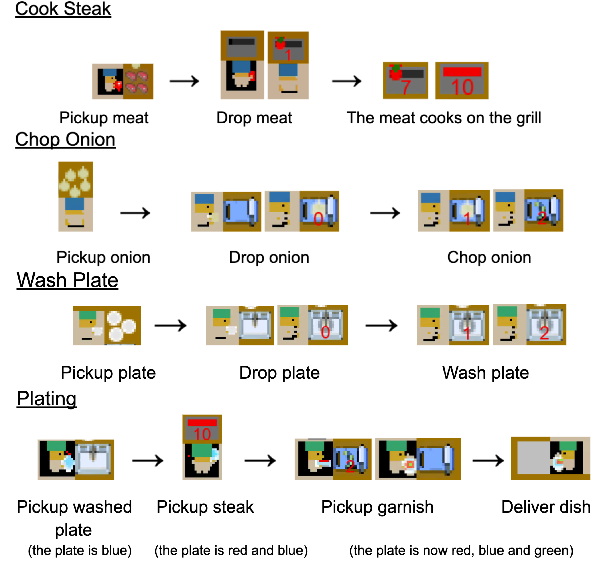
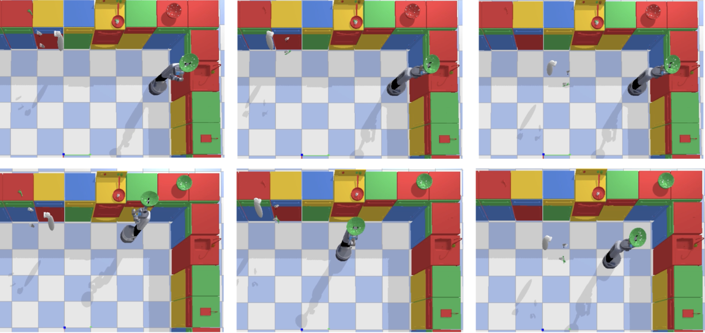

<!-- TOC -->
* [Integrating Field of View in Human-Aware Collaborative](#integrating-human-field-of-view-in-human-aware-collaborative)
  * [Project Overview](#project-overview)
  * [Installation Instructions](#installation-instructions)
  * [Usage](#usage)
  * [Project Structure](#project-structure)
    * [Main Scripts](#main-scripts)
    * [`iGibson`](#igibson)
    * [`src` Components](#src-components)
  * [Task Instructions](#task-instructions)
  * [Results](#results)
      * [Behavior 1: Robot prolongs its visibility to the human](#behavior-1-robot-prolongs-its-visibility-to-the-human)
      * [Behavior 2: Robot chose to take a longer path to enter the human's FOV](#behavior-2-robot-chose-to-take-a-longer-path-to-enter-the-humans-fov)
  * [Citation](#citation)
  * [Contact](#contact)
<!-- TOC -->

# Integrating Field of View in Human-Aware Collaborative #
<p align="center">
   &nbsp;&nbsp;&nbsp;&nbsp;
  
  <br> Baseline (left) shows the robot turning right to go around the counters, whereas the FOV-aware robot (right) goes around the left so that it stays inside the human's field of view for longer showing what it is holding. 
</p>


## Project Overview ##
This open-source code provides a virtual reality (VR) version of the Steak House domain, designed to study human-robot collaboration. It focuses on how knowledge base (KB) gaps—differences between what a human perceives and the actual state of the environment—naturally occur due to the human's limited field of view (FOV) and the time required to complete tasks at specific stations. Researchers can use this code to explore how KB gaps affect human decision-making and task efficiency during collaboration. (Note: the FOV-aware robot planner is found separately [here](https://github.com/SophieHsu/FOV-aware-planner))

Results showed that the FOV-aware planner reduced interruptions and redundant actions during collaboration, with similar collaborative behaviors observed in both 2D (mentioned in the paper) and VR environments. This research addresses a critical gap in human-robot collaboration by accounting for human perceptual limitations, contributing to more natural and efficient teamwork between humans and AI agents.

<p align="center">
  
  <br> Human FOV-aware collaboration planning method
</p>

## Installation Instructions ## 
The project uses multiple repositories to run. This repository contains the primary focus of the VR experiment mentioned in the paper. You would
find it more helpful to refer to [this](https://github.com/SophieHsu/view-aware-hrc) repository for instructions 
to set up the project and to be able to run it on your system.

## Usage ##
- Setup
  - Start by setting up the  config and maps to be the same for both igibson and overcooked. If you're using the
    provided config files. This has already been done for you. 
- Starting the overcooked server
  - Begin running the Overcooked server by navigating to the FOV-aware-planner and run the following script (a baked in restart mechanism for up to 5 restarts in case of crashes due to dropped connections)
      ```
      cd overcooked_ai_py/
      ./steak_api_restart.sh
      ```
  - Note: If planner files need to be recalculated, make sure to delete old planner files.
  - Alternatively, you can run the server without a restart mechanism:
      ```
      python overcooked_ai_py/steak_api_test.py -l steak_none_3 -v 1
      ```
    where, `-v`: Defines the vision limitation of the AI agent. <br>
      1 = Aware (vision limited to the agent's field of view) <br>
      0 = Unaware (omniscient agent) <br>
    and `-l`: Defines the layout file (exclude the .tml extension).
- Running the iGibson Simulator
  - Once the Overcooked server is running, start the iGibson simulation:
    ```
    python 3d_plan_eval_main.py -m vr -c steak_none_3.tml
    ```
  - `-m vr`: Runs the program in VR mode. If left out, the program will simulate a greedy human model operating in 
    the world. Other options are: [`headless`, `headless_tensor`, `gui_non_interactive`, `gui_interactive`, `vr`].
  - `-c steak_none_3.tml`: Defines the configuration file, which must match the config used in Overcooked.
- Playing the Level
  - While playing the level, the system will generate a JSON log file, which is saved in the `lsi_3d/logs` directory. 
    The log file will have a unique ID associated with the run.
- Running the Practice Room
  - Start Overcooked:
    ```
    python overcooked_ai_py/steak_api_test.py -l steak_practice -v 1
    ```
  - Start iGibson in VR mode:
    ```
    python 3d_plan_eval_main.py -m vr -c steak_practice.tml -p 1
    ```

### Project Structure ###
To try your own layout, you can create a `{layout_name}.txt` file in the `kitchen_layout_grid_text` folder.
Then, create an experiment config in `lsi/config/experiment` with parameter `layout={layout_name}.txt`.
You can also add more steak orders or even include [your own new dish](https://github.com/SophieHsu/3d-plan-eval/blob/main/src/config/experiment/steak_mid_2.tml) by setting the `order_list` parameter.

Here are some additional layouts we provide for you to try out:
```
  python 3d_plan_eval_main.py -m vr -c steak_mid_2.tml
  python 3d_plan_eval_main.py -m vr -c steak_side_2.tml
  python 3d_plan_eval_main.py -m vr -c steak_none_3.tml
```
Remember to also change the layout and order parameters on the FOV-aware-planner side.
```
python overcooked_ai_py/steak_api_test.py -l {layout_name} -v 1
```
Highly recommend using the restart mechanism by altering the commend in `overcooked_ai_py/steak_api_restart.sh`

## Project Structure ##
The most relevant components of the project are described below.
```
├── main.py
├── igibson/
├── src/
│   ├── agents/
│   ├── config/
│   ├── environment/
│   ├── logs/
│   ├── mdp
│   ├── motion_controllers/
│   ├── planners/
│   └── utils/
├── README.md
└── utils.py
```

### Main Scripts ###
- `main.py` is the main entry point of the project that defines the necessary `RUNNER` class to 
    run the project.
### `iGibson` ###
- The `iGibson` directory contains the core components for the iGibson simulation framework. Please refer 
    [here](https://github.com/StanfordVL/iGibson) for more details.

### `src` Components ###
- `agents` - This directory contains various files to define the agent classes that are responsible for low and high 
    level control of both the AI agents and the human player.
- `config` - This directory contains the files to set up configurations of the various components of this 
  project, namely, agent, algorithm, experiment, and map. These configs are defined in
  [`toml`](https://toml.io/en/) files. 
- `environment` - This directory consists of files defining the elements of the environment. `vision_limit_env`, 
  `tracking_env`, and `lsi_env` files contain implementations of different kinds of environments. The `kitchen` file
  defines the main class used to tie all components (VR environment, iGibson, planners, etc.) together. Other files, 
  `objects`, `object_configs`, and `actions` define the objects, their configs within the environments, and the actions
  that can be applied to them in the environment respectively.
- `logs` - Directory to store logs from experimental runs of the project.
- `mdp` - Implementation of out mdp solver.
- `motion_controllers` - The controllers that outputs low level movement commends to the VR agent and the robot agent in the VR environment.
- `planners` - Different planner implementations for different environment typer for different agents (human vs AI).
- `utils` - Common utility functions.

## Task Instructions ##
<p align="center">
  
</p>

## Results ##
Our study shows that FOV-aware agents reduce Knowledge Base (KB) gaps and interruptions in environments with limited 
human visibility, like the ∩-shaped kitchen. In open environments, such as the kitchen island, the difference is 
negligible. We validated these findings in a VR kitchen, where FOV-aware agents adapted to human behavior by staying 
within the human's field of view, enhancing collaboration.

#### Behavior 1: Robot prolongs its visibility to the human ####

Fig 1.1: The human starts by picking up a green onion. In the top row, the unaware robot goes to the sink to wash dishes. In the bottom row, the aware robot moves closer to the human, allowing them to see the robot and its actions for at least three consecutive timesteps when the human turns to drop off the green onion.

Another example is the following where the unaware robot (left) picks up the cooked meat and moves to the chopping board. The FOV-aware robot (right) stopped halfway to the chopping board and continued until the human turned over and had the robot in FOV for three steps.
<p align="center">
   &nbsp;&nbsp;&nbsp;&nbsp;
  
</p>

#### Behavior 2: Robot chose to take a longer path to enter the human's FOV ####

Fig 2: In the top row (unaware robot), the robot collects garnish from the chopping board and takes the shorter path on the left to deliver the dish. In the bottom row (aware robot), the robot waits for the human to notice it is picking up the garnish and, afterward, takes the longer route to deliver the dish, which enables it to remain within the human's FOV.

## Citation ##
Please cite this work using the following BibTex:
```
Coming soon
```

## Contact ##
For any questions, please reach out to: [yachuanh@usc.edu](mailto:yachuanh@usc.edu)
